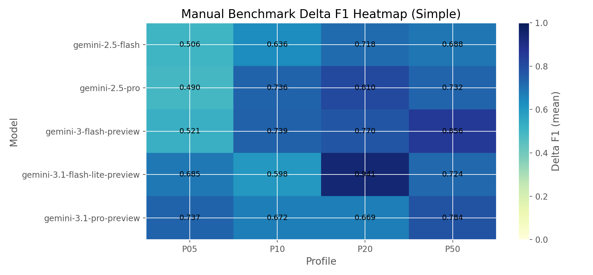
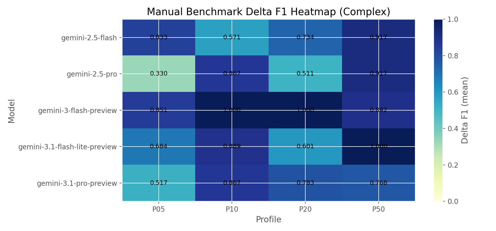
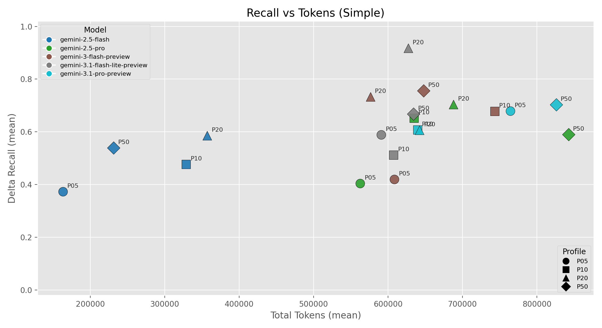
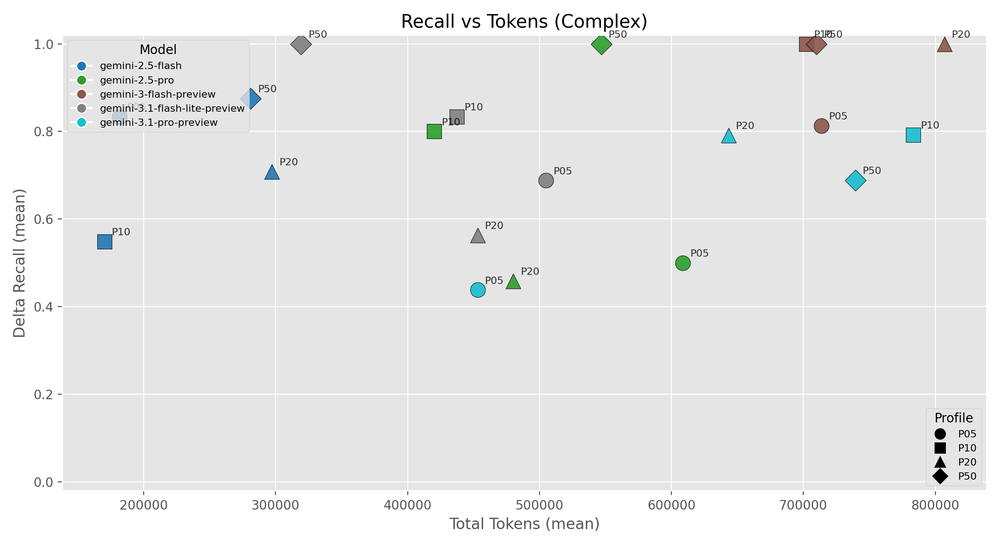
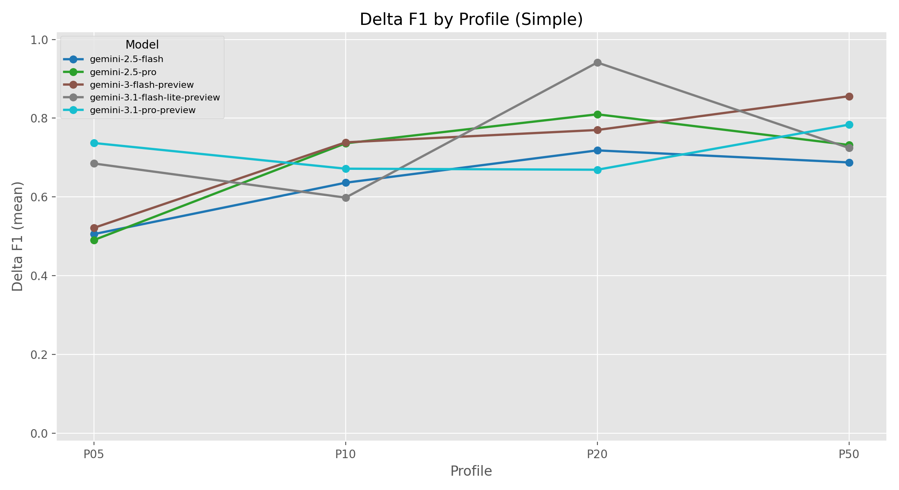
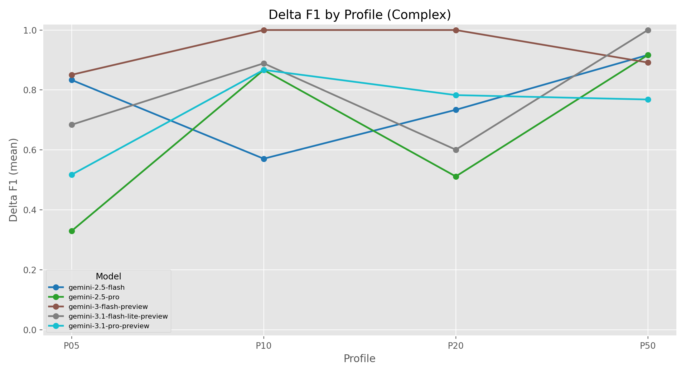

# LLM Data Quality Guardrails: What I Learned Benchmarking Data Quality in Healthcare Data

*March 2026*
  
*Author:* Rebekah Xing

Data quality work is often repetitive, fragile, and expensive to maintain. In healthcare-style tabular data, these issues become even higher stakes: missed anomalies can impact reporting, billing, and downstream analysis.

This project asked a practical question:

**Can a multi-agent LLM system automatically generate useful SQL quality checks, and what profiling budget gives the best quality-per-cost tradeoff?**

---

## Why this problem matters

Traditional data quality systems rely on hand-authored rules. That works for stable domains, but it breaks down when:

- schemas evolve
- new value patterns appear
- semantic/temporal issues are introduced
- vendor decided to make updates
- incorrect data entry

I wanted a system that could look at data shape, propose test and checks, run them safely, and produce auditable outputs without hardcoding every rule from scratch. With the rules identified by the LLM system, the existing hardcoded checks can be improved. 

---

## Approach in one paragraph

I built a sequential multi-agent pipeline (`dq_profiler -> dq_planner -> dq_executor -> dq_supervisor`) with Google ADK. The benefit of seperating the agents so that they are highly specialized and have enough context window to work on the task. I have ran into hallucination issues where having only one agent would forget the prompt. 
The profiler returns schema + sampled rows. The planner proposes SQL tests. The executor runs **read-only SQL** with guardrails. The supervisor writes structured summaries and logs. I evaluate with synthetic corruption ground truth and report `delta_precision`, `delta_recall`, `delta_f1`, and token usage.

---

## Dataset snapshot

Source: Kaggle Healthcare Dataset (synthetic)  
https://www.kaggle.com/datasets/prasad22/healthcare-dataset

| Attribute | Value |
|---|---|
| File | `healthcare_dataset.csv` |
| File size | ~8.0 MB |
| Rows | 55,500 |
| Columns | 15 |
| Raw dtype mix | 12 `object`, 2 `int64`, 1 `float64` |
| Table in DB | `healthcare_dataset` |

Corruptions were injected with tracked ground truth:

- **Simple:** nulls, truncation, outliers, duplicates, future dates
- **Complex:** temporal inversion/shift, code drift, unit mismatch, ID fragmentation, enum encoding drift

---

## Experimental matrix

I benchmarked across:

- models (`gemini-2.5-*`, `gemini-3-*`),
- profile levels (`P05`, `P10`, `P20`, `P50`),
- scenarios (`simple`, `complex`),
- repeated runs with different seeds.

### Run coverage by model

| model | complex runs | simple runs | total runs |
|:--|--:|--:|--:|
| gemini-2.5-flash | 21 | 23 | 44 |
| gemini-2.5-pro | 17 | 17 | 34 |
| gemini-3-flash-preview | 12 | 12 | 24 |
| gemini-3.1-flash-lite-preview | 14 | 14 | 28 |
| gemini-3.1-pro-preview | 16 | 14 | 30 |

---

## Results at a glance

### Best-performing cells (run_count >= 3)

| Scenario | Model | Profile | Runs | Precision | Recall | F1 | Total tokens (mean) |
|:--|:--|:--|--:|--:|--:|--:|--:|
| complex | gemini-3.1-flash-lite-preview | P50 | 3 | 1.0000 | 1.0000 | 1.0000 | 319,185 |
| complex | gemini-3-flash-preview | P20 | 3 | 1.0000 | 1.0000 | 1.0000 | 806,864 |
| simple | gemini-3.1-flash-lite-preview | P20 | 4 | 0.9795 | 0.9179 | 0.9414 | 627,066 |
| simple | gemini-2.5-pro | P20 | 5 | 0.9811 | 0.7042 | 0.8099 | 687,745 |

### Plateau-style picks (near-best recall, lowest tokens)

| Scenario | Picked model | Profile | Runs | Precision | Recall | F1 | Total tokens (mean) |
|:--|:--|:--|--:|--:|--:|--:|--:|
| complex | gemini-3.1-flash-lite-preview | P50 | 3 | 1.0000 | 1.0000 | 1.0000 | 319,185 |
| simple | gemini-3.1-flash-lite-preview | P20 | 4 | 0.9795 | 0.9179 | 0.9414 | 627,066 |

---

## Visual evidence

### F1 heatmaps

### Recall vs token usage

### Profile trend lines

---

## What surprised me

1. **More context was not always better.** Some model/profile cells were non-monotonic.
2. **Complex checks had higher variance.** Stability needed repeated seeds to ensure the model is more robust
3. **Guardrails mattered.** Read-only SQL + baseline-delta scoring made failures interpretable and safe.

---

## Limitations

- Synthetic dataset helps reproducibility but may miss some real-world EHR edge cases.
- Some top-performing cells still need more repeated runs for stronger confidence bounds.
- API quota/transient model errors can create selection bias if failed runs are ignored.

---

## Closing

The benchmark suggests LLM-driven data quality guardrails are viable, measurable, and practical, especially when paired with:

- corruption-ground-truth evaluation,
- baseline-delta scoring,
- and profile-budget sweeps instead of one-size-fits-all prompting.

For this dataset and run set, the strongest quality-per-cost recommendation is:

- **Simple issues:** `gemini-3.1-flash-lite-preview @ P20`
- **Complex issues:** `gemini-3.1-flash-lite-preview @ P50`

For next steps:

- More models from other frontier AI labs should be tested
- More tests (1000+ runs) should happen to ensure the accuracy of the results

---

## References

- Kaggle Healthcare Dataset: https://www.kaggle.com/datasets/prasad22/healthcare-dataset  
- Google ADK docs: https://google.github.io/adk-docs/  
- Gemini API docs: https://ai.google.dev/  
- SQLite docs: https://www.sqlite.org/  
